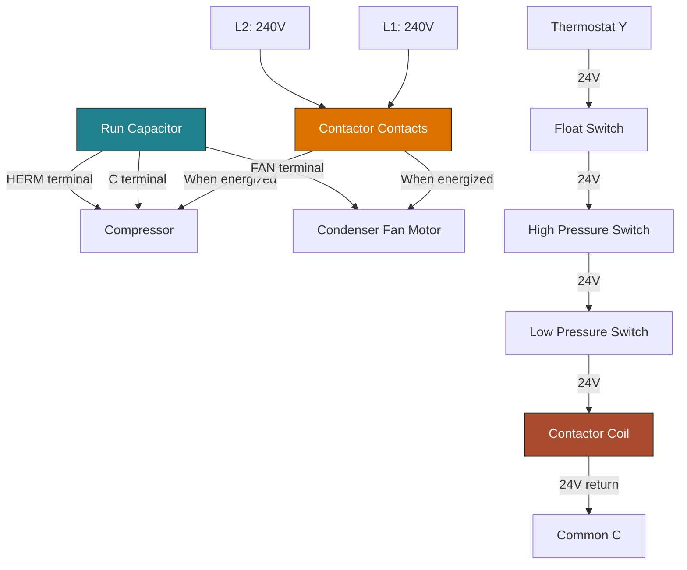

# Contactor & Capacitor Motor Circuit Diagram (Mermaid)

## Capacitor Terminal Guide

| Terminal | Connects To |
|----------|-----------|
| C (Common) | Line power + run winding |
| HERM | Compressor start/run winding |
| FAN | Condenser fan motor |

## Safety

**Capacitors store energy even when power is off.**
1. Discharge with a 20kΩ resistor across terminals
2. Wait 30 seconds, short terminals again
3. Verify with meter before handling
4. Never short with a screwdriver (can damage cap or cause arc)

## Contactor Testing

| Test | Method | Expected |
|------|--------|----------|
| Coil voltage | Meter across coil terminals | 24V when thermostat calls |
| Coil continuity | Meter ohms across coil | 10-30Ω (varies by model) |
| Contacts (energized) | Meter across closed contacts | ~0V (no voltage drop) |
| Contacts (de-energized) | Meter across open contacts | 240V (full voltage) |
| Visual | Inspect contact faces | No pitting, burning, or debris |

## Capacitor Testing

| Test | Method | Expected |
|------|--------|----------|
| Capacitance | Capacitance meter across terminals | Within ±10% of rated MFD |
| Visual | Inspect top and body | No bulging, leaking, or case damage |
| Short to ground | Ohm meter, terminal to case | Infinite (OL) |
