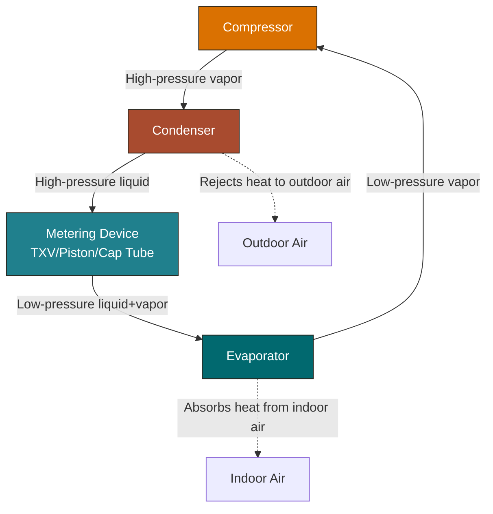

# Refrigeration Cycle Diagram (Mermaid)

## Component Details

| Component | Function | Location |
|-----------|----------|----------|
| Compressor | Raises pressure/temp of refrigerant vapor | Outdoor unit |
| Condenser | Rejects heat, vapor → liquid | Outdoor unit |
| Metering Device | Drops pressure, liquid → mixed phase | Indoor unit (TXV) or outdoor (piston) |
| Evaporator | Absorbs heat, liquid → vapor | Indoor unit |

## Pressure/Temperature Zones

- **High side:** Compressor discharge → condenser → metering device inlet
  - R410A: ~350-450 PSI, 100-120°F saturated
- **Low side:** Metering device outlet → evaporator → compressor suction
  - R410A: ~100-140 PSI, 40-55°F saturated

## Common Metering Device Types

1. **TXV (Thermostatic Expansion Valve)** — modulates based on superheat, most efficient
2. **Fixed piston/orifice** — simple, charge-sensitive, common in lower-end units
3. **Capillary tube** — used in small systems (window units, mini-splits)
4. **EEV (Electronic Expansion Valve)** — electronically controlled, variable capacity
