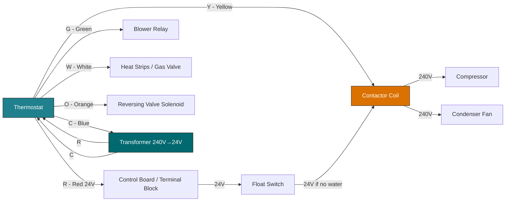

# Thermostat Low-Voltage Wiring Diagram (Mermaid)

## Terminal Reference

| Terminal | Color | Function |
|----------|-------|----------|
| R / RH / RC | Red | 24V power (heat/cool) |
| C | Blue | Common return |
| Y / Y1 | Yellow | Cooling call → contactor |
| G | Green | Fan / blower |
| W / W1 | White | Heating call |
| O | Orange | Reversing valve — energize in COOL (most brands) |
| B | Dark Blue | Reversing valve — energize in HEAT (Ruud/Rheem) |
| W2 | White (2nd) | Auxiliary / 2nd-stage heat |
| Y2 | Yellow (2nd) | 2nd-stage cooling |

## Reversing Valve Brand Reference

| Brand | Energize In | Terminal |
|-------|-----------|----------|
| Carrier, Trane, Goodman, most | Cooling | O |
| Ruud, Rheem | Heating | B |

## Float Switch Wiring

- **Break R method:** Kills thermostat + defrost board (most common)
- **Break Y method:** Kills cooling only (thermostat stays active)
- Always verify which method is used before troubleshooting
